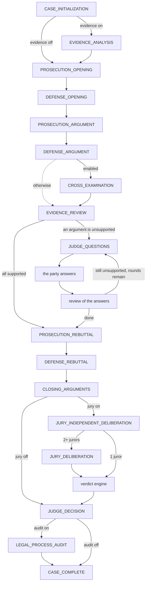

# Multi-Agent Legal Court Simulation System

A research-oriented multi-agent AI application that simulates a fictional legal court to study how specialized AI agents can collaboratively and adversarially reason about legal cases.

**IMPORTANT DISCLAIMER**: This is a fictional legal simulation for research purposes only. This system does not provide legal advice or determine real legal rights or obligations.

## Overview

The Court Simulation System uses multiple specialized AI agents to simulate court proceedings in the fictional jurisdiction of the **Republic of Arandia**. The system maintains strict separation between facts, evidence, laws, arguments, and decisions to prevent hallucinations and ensure evidence-grounded reasoning.

## Key Features

- **Multi-Agent Architecture**: Specialized agents for prosecution, defense, evidence analysis, judge, jury, and legal auditing
- **Structured Legal Rules**: Laws defined as structured data with explicit conditions and effects
- **Evidence Grounding**: All claims must reference valid evidence IDs - fabricated references are rejected
- **Hallucination Prevention**: Validation layer ensures agents cannot invent facts, evidence, or laws
- **Observable Workflow**: LangGraph state machine tracks all court procedure stages
- **Provider Agnostic**: LLM abstraction layer supports OpenAI, Anthropic, and future local models

## Project Status

**Current Phase**: Phase 10 - Frontend Visualization ✅

### Completed
- ✅ Domain models (Case, Fact, Evidence, Witness, LegalRule, Argument, Verdict, AuditReport)
- ✅ Seed data for legal principles, criminal laws, and evidence rules
- ✅ CASE_001: "The Night Intruder" - Complete with facts, evidence, and witnesses
- ✅ Legal rule registry with indexed, read-only access to all 17 rules
- ✅ Deterministic rule engine: facts + evidence → conditions → rule status → effects
- ✅ Element bindings linking CASE_001 material to individual legal elements
- ✅ Witness reliability scoring under evidence rule E003
- ✅ Conflict detection under evidence rule E004
- ✅ Reference validator rejecting fabricated evidence/fact/witness/law IDs
- ✅ Provider-agnostic LLM layer: Anthropic, OpenAI, and local OpenAI-compatible servers
- ✅ Judge Agent: Case → Judge → Decision with validated, structured output
- ✅ Reject-and-regenerate loop for fabricated references and incomplete decisions
- ✅ Every LLM call logged (agent, prompt version, model, input, output, tokens, latency, validation)
- ✅ Prosecution and Defense agents with evidence-grounded, validated arguments
- ✅ Adversarial trial: openings → arguments → rebuttals → closings → judge
- ✅ Structured agent messages (`CourtMessage`) - no free-form chat
- ✅ Judge must weigh both sides; advocates must separate assumptions from facts
- ✅ Neutral Evidence Agent: claim status, contradictions, witnesses, missing evidence
- ✅ Evidence review of every argument - unsupported claims detected mid-trial
- ✅ Evidence provenance traced deterministically from the record
- ✅ Three independent jurors, then an optional controlled deliberation round
- ✅ Deterministic verdict engine: unanimous or majority rule, hung juries, agreement metrics
- ✅ Legal Process Auditor: deterministic integrity checks plus an auditor agent
- ✅ AuditReport with evidence, legal, reasoning, procedural, and hallucination findings
- ✅ Saved trials can be re-audited without re-running them
- ✅ The full spec §14 procedure as a LangGraph state machine with conditional transitions
- ✅ Cross-examination, and judge questions when an argument lacks evidence
- ✅ Typed `CourtState` with every spec §17 field; live events as the court runs
- ✅ HTTP API: browse cases and rules, start simulations, follow them, read results
- ✅ Server-Sent Events stream every court event as it happens
- ✅ OpenAPI docs at `/docs`, ready for the frontend
- ✅ Next.js courtroom dashboard: case selection, the record, and a live trial
- ✅ The bench, the timeline, and the event feed update as the court runs
- ✅ Evidence, legal rules, debate, jury, judge decision, and audit panels
- ✅ Streams over `EventSource`, falling back to polling if the stream drops
- ✅ Comprehensive unit tests
- ✅ Project structure and configuration

### Upcoming Phases
- ⏳ Phase 11: Evaluation Framework
- ⏳ Phase 12: Production Readiness

## Technology Stack

### Backend
- **Python 3.11+**
- **FastAPI** - Web framework
- **LangGraph** - Agent workflow orchestration
- **Pydantic** - Data validation
- **SQLAlchemy** - ORM
- **PostgreSQL** - Database

### AI/LLM
- **LangChain** - LLM abstraction
- **OpenAI API** - GPT models
- **Anthropic API** - Claude models
- Support for local models (future)

### Frontend
- **Next.js 16** (App Router) - React framework
- **TypeScript** - Type safety
- **Tailwind CSS 4** - Styling
- **Vitest + Testing Library** - Component and hook tests

## Project Structure

```
Court_Simulation/
├── backend/
│   ├── app/
│   │   ├── domain/              # Core domain models (Pydantic)
│   │   │   └── models.py        # Case, Fact, Evidence, etc.
│   │   ├── seed/                # Seed data loaders
│   │   │   ├── cases.py         # Test cases
│   │   │   ├── element_bindings.py  # Case material ↔ legal elements
│   │   │   └── legal_data.py    # Legal rules
│   │   ├── rules/               # Legal rule engine
│   │   │   ├── engine.py        # Rule + case evaluation
│   │   │   ├── evaluator.py     # Condition evaluation, witness reliability
│   │   │   ├── registry.py      # Indexed legal rule lookup
│   │   │   ├── validator.py     # Reference validation (anti-hallucination)
│   │   │   ├── models.py        # Evaluation results and policy
│   │   │   └── data/            # JSON legal rules
│   │   │       ├── principles.json
│   │   │       ├── criminal_laws.json
│   │   │       └── evidence_rules.json
│   │   ├── agents/
│   │   │   ├── base.py          # Shared generate → validate → regenerate loop
│   │   │   ├── record.py        # The case record every agent sees
│   │   │   ├── advocate/        # Prosecution + Defense agents
│   │   │   ├── evidence/        # Evidence Agent + deterministic provenance
│   │   │   ├── jury/            # Juror agents + deterministic verdict engine
│   │   │   ├── auditor/         # Legal Process Auditor + AuditReport assembly
│   │   │   └── judge/           # Judge Agent: prompts, schema, validation
│   │   ├── workflow/
│   │   │   ├── judge_only.py    # Case → Judge → Decision
│   │   │   ├── evidence_only.py # Case → Evidence Agent
│   │   │   ├── graph.py         # The full procedure: LangGraph state machine
│   │   │   ├── steps.py         # Court stages shared by both runners
│   │   │   ├── run.py           # TrialRun: everything a trial produced
│   │   │   ├── audit.py         # Deterministic integrity checks over a trial
│   │   │   └── adversarial.py   # Linear runner for custom stage plans
│   │   ├── llm/                 # Provider-agnostic LLM layer + interaction log
│   │   ├── api/                 # FastAPI app, routers, run manager
│   │   ├── cli.py               # python -m app.cli court|trial|serve|audit|…
│   │   └── config.py            # Configuration management
│   ├── tests/
│   │   ├── test_domain/         # Domain model tests
│   │   ├── test_rules/          # Rule engine tests
│   │   ├── test_llm/            # LLM layer tests (no network)
│   │   ├── test_agents/         # Agent, trial, and audit tests
│   │   └── test_api/            # HTTP API tests
│   ├── requirements.txt
│   ├── pyproject.toml
│   └── pytest.ini
├── frontend/
│   ├── src/
│   │   ├── app/                 # App Router pages
│   │   │   ├── page.tsx         # Case selection
│   │   │   ├── cases/[caseId]/  # The record + start a simulation
│   │   │   ├── runs/[runId]/    # The live courtroom dashboard
│   │   │   └── rules/           # The law of Arandia
│   │   ├── components/          # Courtroom, timeline, feed, panels/
│   │   ├── hooks/               # useRunStream (SSE + polling fallback)
│   │   └── lib/                 # API client, types, event derivation
│   ├── package.json
│   └── README.md
├── .env.example                 # Environment variables template
├── README.md
└── Promot.md                    # Original requirements
```

## Setup Instructions

### Prerequisites

- Python 3.11 or higher
- PostgreSQL (for future phases)
- Git

### Installation

1. **Clone the repository**
   ```bash
   git clone <repository-url>
   cd Court_Simulation
   ```

2. **Create virtual environment**
   ```bash
   cd backend
   python -m venv venv

   # On Windows
   venv\Scripts\activate

   # On macOS/Linux
   source venv/bin/activate
   ```

3. **Install dependencies**
   ```bash
   pip install -r requirements.txt
   ```

4. **Configure environment**
   ```bash
   cp ../.env.example ../.env
   # Edit .env with your API keys
   ```

### Running Tests

```bash
# Run all tests
pytest

# Run with coverage
pytest --cov=app --cov-report=term-missing

# Run specific test file
pytest tests/test_domain/test_models.py -v
pytest tests/test_rules/test_engine.py -v

# The frontend suite (from frontend/)
npm test
npm run typecheck
```

### Current Test Results

```
Backend: 549/549 passing ✅ (no network or API key needed)
Frontend: 60/60 passing ✅ (vitest; no backend needed)
- Domain Models: 21 tests
- Seed Data: 20 tests
- Rule Registry: 13 tests
- Condition Evaluator: 20 tests
- Rule Engine: 27 tests
- Reference Validator: 18 tests
- CASE_001 Evaluation: 28 tests
- LLM Providers: 16 tests
- LLM Support (schema, log, factory): 24 tests
- Judge Validation: 22 tests
- Judge Agent: 17 tests
- Judge Workflow + CLI: 11 tests
- Prosecution + Defense Agents: 33 tests
- Adversarial Trial + CLI: 23 tests
- Evidence Agent: 46 tests
- Evidence in the Trial + CLI: 25 tests
- Jury Agents + Verdict Engine: 34 tests
- Jury in the Trial + CLI: 22 tests
- Auditor Agent + Report: 21 tests
- Audit of Trials + CLI: 26 tests
- Judge Questions + Cross-Examination: 22 tests
- Court Graph (LangGraph) + CLI: 28 tests
- API read endpoints: 10 tests
- API simulations, streaming, failures: 22 tests
- Frontend - courtroom vocabulary and the live feed: 14 tests
- Frontend - state derived from the event stream: 16 tests
- Frontend - the panels, from a real finished run: 16 tests
- Frontend - the API client: 9 tests
- Frontend - following a run (SSE + polling fallback): 5 tests
```

## Domain Models

### Core Entities

- **Case**: Top-level entity containing facts, evidence, witnesses, charges, and applicable laws
- **Fact**: A statement that may be established, disputed, or unknown
- **Evidence**: Information supporting or contradicting claims (cannot be modified by agents)
- **Witness**: Person providing testimony with reliability factors
- **LegalRule**: Structured legal rule with conditions and effects
- **Argument**: Claim made by an agent with evidence and law references
- **Verdict**: Decision by judge or jury with reasoning
- **AuditReport**: Quality assessment of the simulation process

### Legal Rules

**Principles** (5 rules):
- P001: Presumption of Innocence
- P002: Burden of Proof
- P003: Evidence Requirement
- P004: Reasonable Doubt
- P005: Evidence Consistency

**Criminal Laws** (7 rules):
- LAW_101: Assault
- LAW_102: Aggravated Assault
- LAW_103: Theft
- LAW_104: Burglary
- LAW_201: Self Defense
- LAW_202: Excessive Defensive Force
- LAW_301: Attempt

**Evidence Rules** (5 rules):
- E001: Direct Evidence
- E002: Circumstantial Evidence
- E003: Witness Reliability
- E004: Conflicting Evidence
- E005: Fabricated Evidence

## Legal Rule Engine

The rule engine evaluates structured legal rules against a case record without
any LLM involvement. Agents may later propose *which* material bears on a legal
element, but the engine always computes the conclusion itself.

```
Facts + Evidence --(element bindings)--> Conditions --> Rule status --> Effects
```

### Usage

```python
from app.seed import get_case_by_id, get_case_001_bindings
from app.rules import ReferenceValidator, RuleEngine

case = get_case_by_id("CASE_001")
bindings = get_case_001_bindings()

# 1. Nothing is evaluated before its references are verified
assert ReferenceValidator(case).validate_bindings(bindings).valid

# 2. Evaluate every applicable law, per party
evaluation = RuleEngine().evaluate_case(case, bindings)

for result in evaluation.rule_evaluations:
    print(result.rule_id, result.subject, result.status.value)
```

### How conditions are decided

Each referenced fact contributes a weight from its status (established 1.0,
disputed 0.5, unknown 0.25) and each evidence item contributes
`reliability × type factor` (physical/forensic/digital/documentary 1.0,
testimonial 0.85, circumstantial 0.7). A condition's strength is that of its
strongest single reference on each side, then:

| Support ≥ 0.6 | Contradiction ≥ 0.4 | Condition status |
|---|---|---|
| yes | no  | `satisfied` |
| yes | yes | `disputed` |
| no  | yes | `unsatisfied` |
| no  | no  | `unsupported` |

A rule is `satisfied` when every required condition is satisfied,
`not_satisfied` when any required condition is contradicted, and
`indeterminate` while a required condition stays disputed or unsupported.
Rules that state no conditions (the principles) are `unconditional`. All
thresholds and weights live in `EvaluationPolicy`, so experiments can vary
strictness without touching the evaluation logic.

### What CASE_001 evaluates to

| Rule | Subject | Status | Why |
|---|---|---|---|
| LAW_104 Burglary | Alex Johnson | indeterminate | Entry established (E001, E002); no evidence of intent to commit an offence inside |
| LAW_101 Assault | Alex Johnson | not_satisfied | Alleged attack rests on disputed F004 and is contradicted by E007 |
| LAW_101 Assault | David Thompson | indeterminate | Force and contact established; unlawfulness disputed |
| LAW_102 Aggravated Assault | David Thompson | indeterminate | Serious injury established (E004); assault element inherited from LAW_101 |
| LAW_201 Self Defense | David Thompson | not_satisfied | Reasonable belief established, but necessity and proportionality are contradicted |
| LAW_202 Excessive Force | David Thompson | indeterminate | Force used is established; whether it exceeded the threat is contested |
| P001–P005 | case-wide | unconditional | Principles apply to every criminal case |

No offense or defense effect is triggered on the seeded record - the engine
reports open questions rather than resolving them, which is what later agent
phases exist to argue about.

### Other engine outputs

- **Witness reliability (E003)**: deterministic scores from declared factors -
  Margaret Foster 0.95, David Thompson 0.65, Alex Johnson 0.15, each with its
  challenge grounds listed.
- **Conflicts (E004)**: contested legal elements and facts that evidence both
  supports and contradicts.
- **Reference validation**: every evidence, fact, witness, and law ID cited by
  an agent is checked against the case and registry; failures come back as
  audit-report-shaped violation records, never silent acceptance.

## Judge Agent (Phase 3)

The first LLM-backed stage: **Case → Judge Agent → Decision**.

```bash
cd backend
python -m app.cli judge CASE_001 --show-prompt          # inspect the prompt, no API call
python -m app.cli judge CASE_001 --provider anthropic   # needs ANTHROPIC_API_KEY
python -m app.cli judge CASE_001 --provider openai      # needs OPENAI_API_KEY
python -m app.cli judge CASE_001 --provider local --model llama3.1   # Ollama
```

The judge receives the full case record **and** the rule engine's evaluation,
and must return structured JSON that keeps established facts, disputed facts,
applicable rules, arguments, analysis, and decision separate. Every element of
every charged offense must be assessed, with the facts and evidence it rests on.

Before a decision is accepted it passes three checks:

| Check | Examples | On failure |
|---|---|---|
| References | an evidence, fact, rule, or argument ID that doesn't exist | rejected, regenerated |
| Structure | a charge undecided or invented, an element skipped, guilty on an element not found established | rejected, regenerated |
| Engine alignment | judge convicts where the engine found the offense indeterminate | recorded as a divergence (rejected with `--strict`) |

A rejected decision goes back to the model with the exact reasons. After
`LLM_MAX_ATTEMPTS` rejections the run fails loudly - an unvalidated decision is
never returned. Every call, rejected or accepted, is appended to
`logs/llm_interactions.jsonl`.

## The Courtroom Dashboard (Phase 10)

```bash
cd frontend
npm install
npm run dev          # http://localhost:3000 (backend on :8000 first)
```

| Route | |
|---|---|
| `/` | Case selection, and the simulations run so far |
| `/cases/{case_id}` | Facts, evidence, witnesses, laws, what the rule engine computed - and the form that starts a trial |
| `/runs/{run_id}` | The live courtroom: the bench, the timeline, the event feed, and every panel |
| `/runs` | Every run the server remembers |
| `/rules` | The 17 legal rules of Arandia |

A trial takes minutes, so the dashboard subscribes to
`/api/runs/{id}/stream` with `EventSource` and updates as each event arrives:
the seat of whichever agent is working lights up, the timeline fills in, and
the feed reports what was presented, reviewed, asked, and decided. If the
stream drops it falls back to polling `?after=N`, which returns the same
numbered events.

While a run is going, everything shown comes from the events. The full text of
the arguments, verdicts, and audit arrives with the finished run - the panels
say which they are showing rather than filling the gap with a guess.

Spec §24's disclaimer is in the header of every page: **research simulation
only; this system does not provide legal advice or determine real legal rights
or obligations.**

## The HTTP API (Phase 9)

```bash
cd backend
pip install -r requirements.txt
python -m app.cli serve          # http://127.0.0.1:8000/docs
```

`/docs` is the interactive reference (OpenAPI). A simulation is minutes of
model calls, so starting one returns a run ID at once and the client follows
it:

| Method | Path | |
|---|---|---|
| GET | `/health` | liveness, and how many runs are active |
| GET | `/api/cases` | the seeded cases |
| GET | `/api/cases/{case_id}` | the record, the rule engine's evaluation, evidence provenance |
| GET | `/api/rules`, `/api/rules/{rule_id}` | the legal rules of Arandia |
| POST | `/api/cases/{case_id}/simulate` | start a run → `202` with its ID |
| GET | `/api/runs` | every run this server remembers |
| GET | `/api/runs/{run_id}` | status, and the full result when finished |
| GET | `/api/runs/{run_id}/events?after=N` | events so far (polling) |
| GET | `/api/runs/{run_id}/stream` | the same events as they happen (SSE) |
| GET | `/api/runs/{run_id}/audit` | the audit report |
| DELETE | `/api/runs/{run_id}` | forget a finished run |

```bash
# start a trial and watch it live
curl -X POST localhost:8000/api/cases/CASE_001/simulate \
     -H 'content-type: application/json' -d '{"mode":"court","jurors":3}'
curl -N localhost:8000/api/runs/<run_id>/stream
```

The request body chooses the mode (`court`, `judge`, or `evidence`), which
stages run, the jury size and rule, and optionally the provider and model.
The result is the same `TrialRun` JSON the CLI writes with `--json`.

Runs are kept in memory, so restarting the server forgets them; persistence
is a later phase.

## The Court Procedure (Phase 8)

The full spec §14 procedure runs as a **LangGraph state machine**:

```bash
cd backend
python -m app.cli court CASE_001 --show-graph   # the state machine, no model call
python -m app.cli court CASE_001 --events       # watch every stage as it happens
python -m app.cli court CASE_001 --json > run.json
```



**The judge requests more when an argument lacks evidence** (spec §14). When
`EVIDENCE_REVIEW` finds an argument unsupported by what it cites, the judge
puts questions to the party that made it. The party must answer each question
by ID - citing the record, or narrowing or withdrawing the claim - and the
Evidence Agent reviews the answers. The loop repeats while answers stay
unsupported, up to `--question-rounds` (default 1).

**Cross-examination**: each side tests the testimony the other relies on;
every argument must name the witness it examines.

The graph carries a typed `CourtState` with every field spec §17 lists -
`case`, `current_stage`, `facts`, `evidence`, `applicable_laws`,
`prosecution_arguments`, `defense_arguments`, `evidence_analysis`,
`judge_questions`, `jury_decisions`, `judge_decision`, `audit_report`,
`event_history`. A stage that does not run is recorded with the reason (for
example, "the evidence review found no argument unsupported"), so the audit
can tell "not needed" from "left out".

`trial` still runs **custom stage plans** (any order, repeated stages, the
Phase 4-7 trials exactly). Both runners execute the same steps.

## Adversarial Trial (Phases 4-7)

**Evidence → Prosecution ↔ Defense → Jury → Judge → Audit**.

```bash
cd backend
python -m app.cli trial CASE_001 --show-prompt              # prosecution opening prompt
python -m app.cli trial CASE_001 --provider anthropic       # full trial (18 calls)
python -m app.cli trial CASE_001 --no-jury                 # without the jury (11 calls)
python -m app.cli trial CASE_001 --jurors 5 --jury-rule majority --no-deliberation
python -m app.cli trial CASE_001 --no-evidence             # Phase 4 trial, no Evidence Agent
python -m app.cli evidence CASE_001                        # evidence analysis only (1 call)
python -m app.cli trial CASE_001 --provider anthropic --quick   # openings + closings
```

| Stage | Speaker | Must |
|---|---|---|
| `EVIDENCE_ANALYSIS` | evidence | neutral analysis of the record, before anyone argues |
| `PROSECUTION_OPENING` | prosecution | map evidence to each element |
| `DEFENSE_OPENING` | defense | set out reasonable doubt |
| `PROSECUTION_ARGUMENT` | prosecution | argue element by element |
| `DEFENSE_ARGUMENT` | defense | challenge evidence and inferences |
| `EVIDENCE_REVIEW` | evidence | check every argument so far against its citations |
| `PROSECUTION_REBUTTAL` | prosecution | answer defense arguments by ID |
| `DEFENSE_REBUTTAL` | defense | answer prosecution arguments by ID |
| `CLOSING_ARGUMENTS` | both | summarise |
| `JURY_INDEPENDENT_DELIBERATION` | each juror | verdict per charge, alone |
| `JURY_DELIBERATION` | each juror | reconsider once, seeing the panel |
| `JUDGE_DECISION` | judge | decide, weighing at least one argument from each side |
| `LEGAL_PROCESS_AUDIT` | auditor | inspect how the trial ran, never the verdict |

Every argument names its charges and legal elements, cites facts, evidence,
or witnesses (at least one), lists its **assumptions** separately from facts,
and names the opposing arguments it answers. The court - not the model -
assigns argument IDs (`PR-OPEN-1`, `DF-REB-2`, ...), so every reference in the
debate resolves. A turn that cites anything outside the record, invents a
charge, answers its own side, or rebuts nothing is rejected and regenerated.

Each turn is recorded as one structured `CourtMessage` (sender, recipient,
type, stage, argument IDs, evidence IDs, law IDs) - agents never exchange
free-form chat.

### The Evidence Agent (Phase 5)

A neutral analyst working for the court, not either party. Before the debate
it assesses the important claims - each **established** (supported, nothing
contradicts it), **disputed** (both), or **unsupported** (nothing supports
it) - along with every evidence item (direct or circumstantial), every
contradiction, every witness under rule E003, and the evidence the record
lacks. After the parties' main arguments it reviews each argument: do its
citations actually support its claim?

Its work goes into the record that every later speaker sees, so advocates can
answer the weaknesses it finds and the judge can see which arguments overreach.

A status that contradicts its own citations (an "established" claim with
contradicting evidence, say) is rejected, as is skipping any evidence item,
witness, disputed fact, or argument. Outcome language ("guilty", "acquit") is
flagged as a neutrality breach. **Provenance** - who handled each item and
when, which witness it came from, what the record leaves out - is traced from
the record in code, not asked of the model.

### The Jury (Phase 6)

After closing arguments, three jurors each decide every charge **alone**. Each
juror's input is the trial record and nothing else, so another juror's view
cannot reach it: the three independent prompts are byte-identical. Each juror
gives what spec §8 asks for: verdict, reasoning, evidence and legal rules
relied on, uncertainties, and confidence.

Then, optionally, **one controlled deliberation round**: each juror sees every
juror's independent decision and gives a final verdict. A juror who changes a
vote must cite the record for the new one; going along with the majority is
rejected.

The **verdict engine** - code, not a model - tallies each round. Under the
default unanimous rule, any split is a **hung** jury; the majority rule needs
more than half. It reports agreement before and after deliberation and every
vote that changed: the "verdict agreement" metric of spec §23.

The judge decides last. It sees the jury's result and must explain any
departure from it, and every disagreement between judge and jury is recorded.
Jurors can run on different models (`juror_providers`) or with research
backgrounds (`juror_perspectives`); by default all three get identical
instructions.

### The Legal Process Auditor (Phase 7)

The trial ends by auditing itself. The auditor inspects **how the simulation
ran** - it never says how the case should have been decided - and produces the
`AuditReport`: evidence, legal, reasoning, and procedural findings plus
hallucinations, each with a severity and the IDs involved.

Two layers:

**Deterministic checks** (code, always run) cover what is provable from the
record: every invented ID an agent tried to cite and was caught on; a re-check
of every accepted output's citations; stages of the spec §14 procedure not
completed; a message sent by an agent with no role at that stage; a side's
arguments ignored by the judge or a juror; arguments the Evidence Agent found
unsupported; assumptions presented as facts; the judge going beyond the rule
engine; judge and jury disagreeing; a defense rule argued for a party it does
not concern.

**The auditor agent** adds what code cannot judge - self-contradiction,
misapplied law - and rates the judge's decision chain FACTS → EVIDENCE → LAW →
ANALYSIS → DECISION as sound, weak, or broken. It sees the deterministic
findings and is told not to repeat them.

The overall status is the worst severity found: `clean`, `minor_issues`,
`major_issues`, or `critical_issues`. Info-only findings (such as stages this
simulation does not implement) leave a run clean.

```bash
python -m app.cli trial CASE_001 --deterministic-audit  # audit without a model call
python -m app.cli trial CASE_001 --json > run.json
python -m app.cli audit run.json                        # re-audit a saved trial
python -m app.cli audit run.json --deterministic-only
```

### LLM providers

| `LLM_PROVIDER` | Backend | Default model |
|---|---|---|
| `anthropic` | Anthropic Messages API (structured outputs) | `claude-opus-5` |
| `openai` | OpenAI Chat Completions (strict `json_schema`) | `gpt-4o` |
| `local` | Any OpenAI-compatible server (Ollama, vLLM, LM Studio) | `llama3.1` |

Agents depend only on the `LLMProvider` interface; vendor SDKs are imported
lazily, so only the SDK for the provider you use needs to be installed.

## Test Cases

### CASE_001: The Night Intruder

A home invasion and alleged self-defense case.

**Summary**: Alex Johnson entered David Thompson's home without permission at 11:45 PM through a broken window. David confronted Alex and struck him with a baseball bat, causing serious injuries. Alex is charged with burglary and assault. David claims self-defense.

**Key Issues**:
- Unauthorized entry (burglary)
- Self-defense validity
- Proportionality of defensive force
- Reasonable belief of threat

**Case Components**:
- 8 Facts (established and disputed)
- 8 Evidence items (physical, forensic, digital, testimonial)
- 3 Witnesses (David, neighbor Margaret, Alex)
- 2 Charges (burglary, assault)
- 5 Applicable laws

## Architecture Principles

1. **Separation of Concerns**: Facts, evidence, laws, arguments, and decisions are separate entities
2. **Evidence Grounding**: All agent claims must reference valid IDs from the case database
3. **No Hallucination**: Validation rejects any fabricated references before acceptance
4. **Observability**: All agent actions recorded in event history
5. **Reproducibility**: Structured data and deterministic rule engine
6. **Modularity**: Clean separation between domain, agents, workflow, rules, and LLM

## Future Agents

### Planned Agent Types

- **Case Manager**: Initializes cases and manages workflow
- **Prosecution Agent**: Builds evidence-supported prosecution case
- **Defense Agent**: Challenges prosecution and presents defense
- **Evidence Agent**: Neutral analysis of evidence reliability
- **Judge Agent**: Procedural authority and decision-making
- **Jury Agents** (3): Independent deliberation and verdicts
- **Legal Process Auditor**: Detects violations and assesses quality

## Contributing

This is a research project. Contributions should focus on:
- Maintaining evidence grounding and hallucination prevention
- Clear separation of facts, evidence, and arguments
- Comprehensive testing
- Documentation

## License

[To be determined]

## Research Goals

This system aims to explore:
1. Multi-agent adversarial reasoning
2. Evidence-grounded legal argumentation
3. Hallucination prevention in LLM applications
4. Structured vs. unstructured legal knowledge
5. Agent consistency and reasoning quality
6. Verdict agreement among independent agents

## Contact

[To be determined]

---

**Research Simulation Only**: This system does not provide legal advice or determine real legal rights or obligations.
